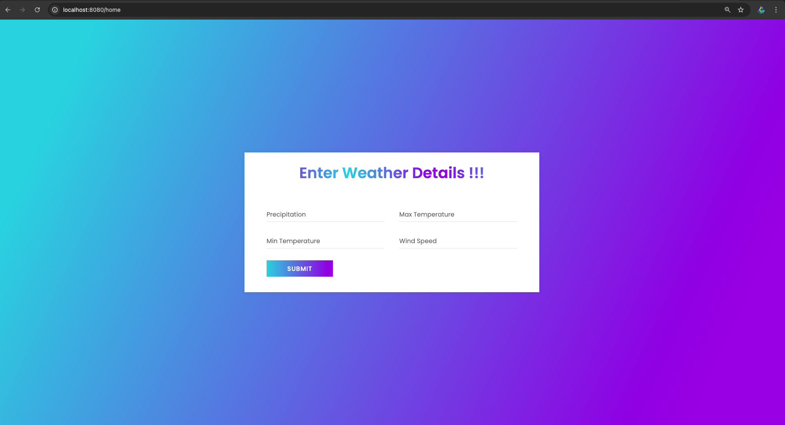

# Weather Prediction Application

This application predicts weather conditions based on user-provided inputs such as precipitation, maximum temperature, minimum temperature, and wind speed. It utilizes a machine learning model to provide predictions.

## Features
- User-friendly input form for weather data.
- Real-time weather prediction using a trained model.
- Displays predictions on a dedicated results page.

## Prerequisites
- Java 11 or later
- Maven
- Python 3.x
- Required Python libraries: `scikit-learn`, `joblib`, `pandas`

## How to Run the Application

1. Clone the repository:
   ```bash
   git clone https://github.com/your-repo/weather-prediction-app.git
   ```

2. Navigate to the project directory:
   ```bash
   cd weather-prediction-app
   ```

3. Install dependencies:
   ```bash
   ./mvnw install
   ```

4. Start the application:
   ```bash
   ./mvnw spring-boot:run
   ```

5. Open a browser and navigate to:
   ```
   http://localhost:8080/home
   ```

## Screenshots

### Home Page
The home page allows users to input weather details such as precipitation, maximum temperature, minimum temperature, and wind speed.



### Results Page
After submitting the form, the results page displays the predicted weather condition.


## Directory Structure
- `src/main/java`: Contains Java source code for the Spring Boot application.
  - `controller/WeatherController.java`: Handles HTTP requests.
  - `service/WeatherPredictionService.java`: Contains the logic for weather prediction.
- `src/main/resources/templates`: Contains HTML templates (`home.html` and `results.html`).
- `src/main/resources/application.properties`: Application configuration.
- `python/weather_predictor.py`: Python script for machine learning model predictions.

## Unit Testing
Unit tests are located in the `src/test/java` directory. To run the tests, execute:
```bash
./mvnw test
```

## Acknowledgments
- [Spring Boot Documentation](https://spring.io/projects/spring-boot)
- [Thymeleaf Documentation](https://www.thymeleaf.org/)
- [scikit-learn Documentation](https://scikit-learn.org/)

## License
This project is licensed under the MIT License. See the `LICENSE` file for details.

